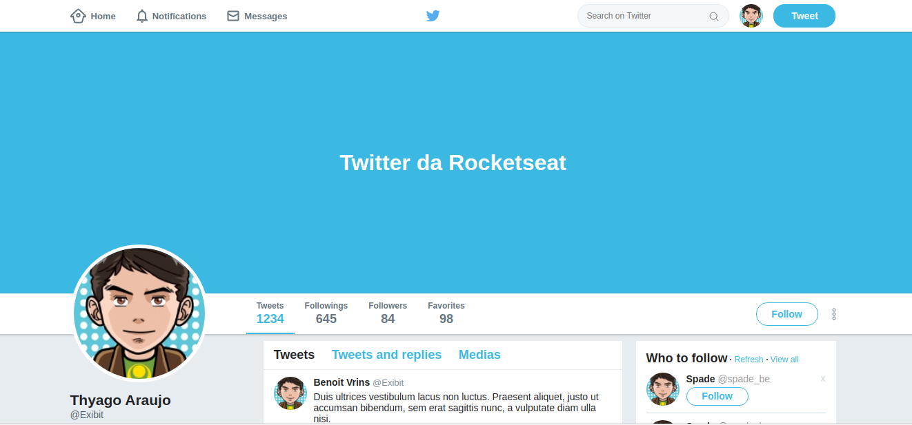
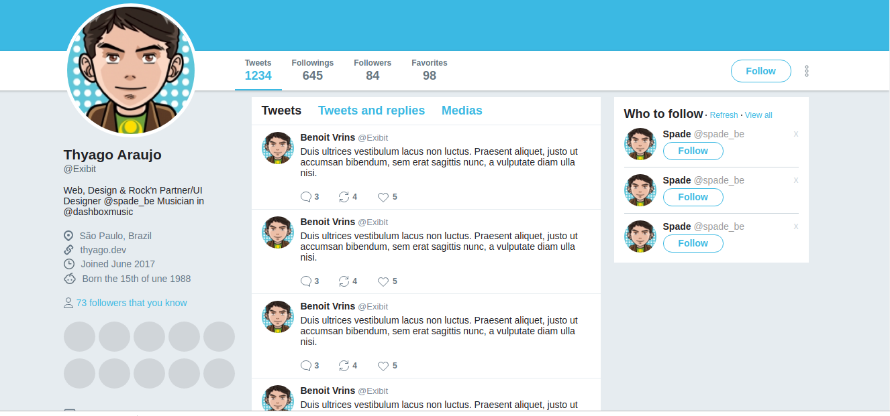

# Twitter-Clone FlexBox

Twitter interface clone made with Html and CSS - FlexBox

### Demo





## :rocket: Technologies

This project was developed with the following technologies:

- HTML
- CSS
- FlexBox
- VS Code

## :information_source: How To Use

```bash
# Clone this repository
$ git clone https://github.com/thyagoaraujo/twitter-clone.git

# Go into the repository
$ cd twitter-clone

# Run the app
$ open index.html
```

## :memo: License

This project is under the MIT license. See the [LICENSE](https://github.com/thyagoaraujo/twitter-clone/blob/master/LICENSE.md) for more information.

---

Made with ♥ by Thyago Araujo :wave: [Get in touch!](https://www.linkedin.com/in/thyagosantosaraujo/)
